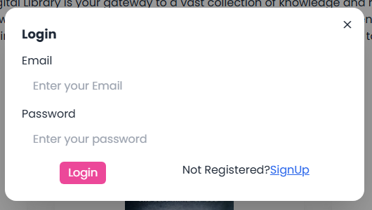
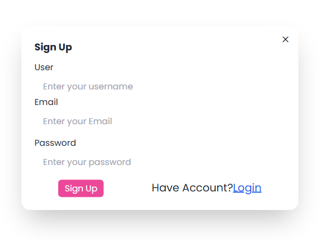

# Digital Library

Welcome to the Digital Library! This project is a web application designed to help users manage and explore a collection of digital books.

######################################################

######################################################

######################################################

######################################################

## Table of Contents
- [Features](#features)
- [Installation](#installation)
- [Usage](#Open your browser and go to http://localhost:5173/.
          #Sign up or log in to your account.
          #Start adding and managing your digital books.)
- [Technologies](#Frontend: React,Vite ,react-router-dom,react-hook-form,react-slick HTML, CSS, JavaScript
Backend: Node.js, Express.js, MongoDB ,Postman
Authentication: JWT (JSON Web Tokens)
)
- [Contributing](#contributing)
- [License](#This project is licensed under the MIT License. See the LICENSE file for details.)

## Features
- **User Authentication**: Users can sign up, log in, and manage their profiles.
- **Book Management**: Add, edit, and delete book information.
- **Search and Filter**: Easily find books by title, author, or genre.
- **Responsive Design**: Optimized for both desktop and mobile devices.

# React + Vite

This template provides a minimal setup to get React working in Vite with HMR and some ESLint rules.

Currently, two official plugins are available:

- [@vitejs/plugin-react](https://github.com/vitejs/vite-plugin-react/blob/main/packages/plugin-react/README.md) uses [Babel](https://babeljs.io/) for Fast Refresh
- [@vitejs/plugin-react-swc](https://github.com/vitejs/vite-plugin-react-swc) uses [SWC](https://swc.rs/) for Fast Refresh

